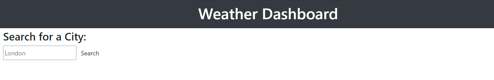
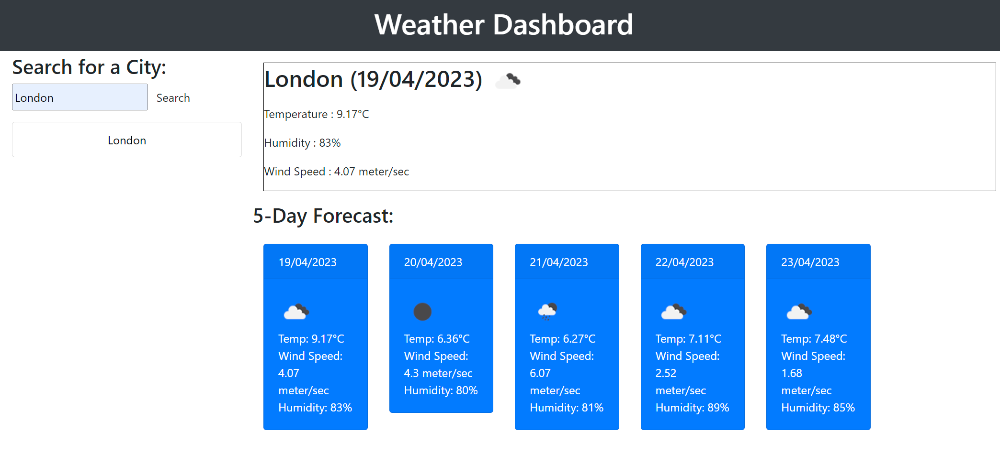

# Module-8-Challenge-Server-Side-APIs-Weather-Dashboard

# Server-Side APIs: Weather Dashboard

## Description

I was tasked with creating a Dashboard which is filled with data purely retrieved via an API. In this case it is a Weather Dashboard where you enter the name of a City and it retrieves 3 key bits of information over a 5-Day forecast - the Temperature, Wind Speed and Humidity.

The challenge was designed to make me use API's in a creative way and to present the data in a readable/viewable format.

The API being called for this task is OpenWeatherMap.

## Installation
Please visit this URL to see how the Application looks now: https://halcyonlegion.github.io/Module-8-Challenge-Server-Side-APIs-Weather-Dashboard/

## Usage

The Challenge is comprised of just the core 3 files. The structure is as I've followed previously with the Index HTML page at the root and the other folders contained within the assets folder. The user may launch the app and enter a City Name to be presented with the Data.

Upon first loading the Dashboard it will appear like this this:

You enter a City Name and click search:

This will return the key information and add the city name to the history list on the left.

## Credits

Usual credits to the teaching staff and support we've recieved over the last few weeks particularly with JavaScript, jQuery and Moment.js.

The University of Birmingham provided the materials and guides I used to get this started: https://www.birmingham.ac.uk/index.aspx

To the incredible people who contribute to Stack Overflow: https://stackoverflow.com/

The creators of the MDN: https://developer.mozilla.org/en-US/

W3 Schools: https://www.w3schools.com/

OpenWeatherMap for the API Key: https://openweathermap.org/

License
There is no license specified for this project.
